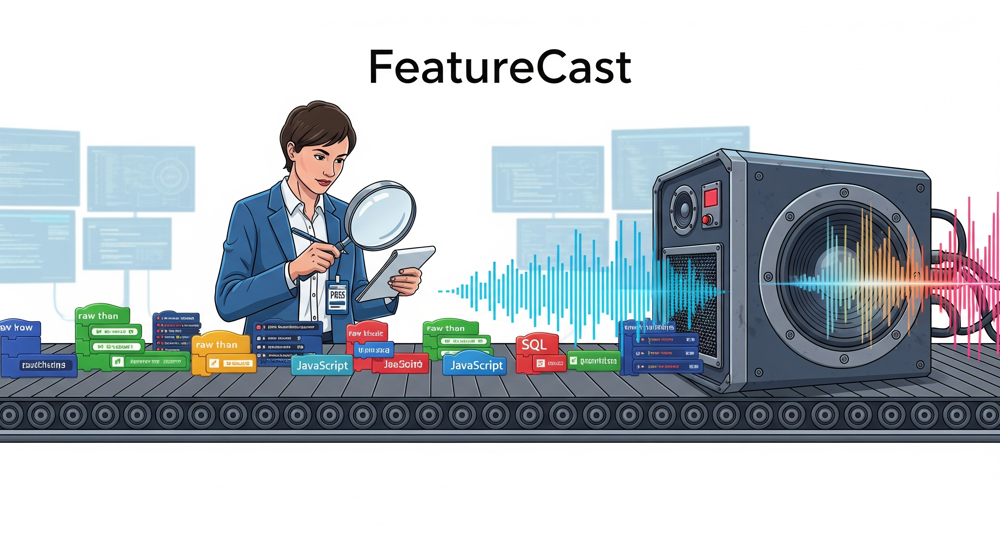

**Turn technical reports into audio summaries**

FeatureCast is an AI agent that converts engineering reports and technical documentation into audio segments. Built with Claude but works with any LLM that supports custom agents, it uses an investigative journalism approach to compare what was built against what was specified, then generates scripts optimized for text-to-speech.

## What It Does

Engineering reports are dense and time-consuming. FeatureCast helps by:

- Comparing implementation reports against specifications
- Identifying gaps and questioning unstated assumptions
- Creating audio-friendly scripts in an NPR-style narrative format
- Converting to audio via text-to-speech for hands-free listening

## How It Works

```
Technical Specification ────────┐
                                ├─► FeatureCast Agent ──► Audio Script ──► TTS ──► Audio File
Engineering Report ─────────────┘
```

The agent acts as a technical correspondent, analyzing documentation with professional skepticism. It doesn't just summarize—it investigates what's missing, questions claims, and explains why technical decisions matter.

## Setup

### Prerequisites

1. **Docker** - For running the TTS server
2. **Node.js 16+** - For the MCP server
3. **ffmpeg** - For audio processing
4. **Claude Desktop or similar** - For running the agent

### Components

The project includes:

- **FeatureCast Agent** (`feature-caster-agent/`): The investigative journalist AI that generates scripts
- **MCP Server** (`featurecast-mcp/`): Tool for converting scripts to audio files
- **TTS Server** (`docker-compose.yml`): Wyoming-Piper for text-to-speech (easily swappable with ElevenLabs or other TTS services)

### Getting Started

1. **Start the TTS server:**
   ```bash
   docker-compose up -d
   ```
   This runs Wyoming-Piper on port 5000.

2. **Set up the MCP server:**
   ```bash
   cd featurecast-mcp
   npm install
   npm run build
   ```
   See `featurecast-mcp/README.md` for detailed MCP configuration with Claude Desktop.

3. **Configure environment:**
   Create `.env` in `featurecast-mcp/`:
   ```bash
   BASE_PROJECT_PATH=/path/to/your/project
   TTS_SERVER_URL=http://localhost:5000/api/text-to-speech
   TTS_VOICE=en_US-hfc_female-medium
   TTS_TIMEOUT_MS=180000  # Adjust for transcript length
   
   # Audio padding (Piper TTS starts abruptly)
   AUDIO_PREROLL_MS=750
   AUDIO_POSTROLL_MS=1000
   ```

4. **Configure Claude Desktop:**
   Add to `~/Library/Application Support/Claude/claude_desktop_config.json`:
   ```json
   {
     "mcpServers": {
       "featurecast": {
         "command": "node",
         "args": ["/path/to/featurecast-mcp/dist/server.js"],
         "env": {
           "TTS_SERVER_URL": "http://localhost:5000/api/text-to-speech",
           "BASE_PROJECT_PATH": "/path/to/your/project"
         }
       }
     }
   }
   ```
   Then restart Claude Desktop.

## Example Workflow

Here's a typical end-to-end flow:

1. **You have technical docs:**
   - `requirements.md` - What the feature should do
   - `engineer-report.md` - What got built

2. **Feed them to the FeatureCast agent:**
   ```
   "I have a PRP spec and an engineer's implementation report. 
   Can you analyze these and create an audio script comparing 
   what was supposed to be built vs what actually got built?"
   ```

3. **Agent generates a script:**
   The agent produces something like:
   ```
   Engineering Report. Today we're examining the authentication 
   system implementation... The specification called for OAuth2 
   with refresh tokens, but our investigation reveals the engineer 
   opted for simpler JWT tokens... Let's explore why this matters...
   ```

4. **Convert to audio via MCP:**
   The MCP tool `generate_audio_cast` takes the script and:
   - Sends it to the TTS server
   - Adds pre/post-roll silence with ffmpeg
   - Saves both the script and audio files

5. **Listen to your technical update:**
   You get a `.wav` file that sounds like an NPR segment about your code.

## Example Output

The `example-output/` directory contains:
- Sample script files (`.md`) - Narrative text optimized for speech
- Audio files (`.wav`) - The final TTS output

## Agent Capabilities

### Investigative Analysis
The agent approaches documentation like an NPR correspondent:
- Compares specs against implementation
- Questions missing information
- Explains technical implications
- Maintains professional skepticism

### Audio-Optimized Output
Scripts are written specifically for listening:
- Continuous narrative flow (no bullets or headers)
- Natural speech transitions
- Spelled-out acronyms on first use
- Pacing markers with ellipses

### Learning System
The agent improves through `INSIGHTS.md`, building a library of:
- Effective narrative techniques
- Proven analogies and explanations
- Communication patterns that work
- Anti-patterns to avoid

## Repository Structure

```
├── docker-compose.yml              # TTS server configuration
├── example-output/                 # Sample scripts and audio
├── feature-caster-agent/
│   ├── system-prompt.md           # Agent instructions
│   └── INSIGHTS.md                # Learning library
├── featurecast-mcp/               # MCP server for audio generation
│   ├── src/                       # TypeScript source
│   ├── README.md                  # MCP setup guide
│   └── package.json
└── images/                        # Documentation assets
```

## Use Cases

- Sprint report reviews during commutes
- Technical documentation for visual fatigue
- Architecture decision records as audio
- Code review summaries for team updates
- Onboarding materials in audio format

## Why Audio?

Audio documentation offers some advantages:
- Listen while doing other tasks
- Different cognitive processing than reading
- Good for complex technical narratives
- Useful when screen time needs limiting

## Technical Details

- **TTS**: Wyoming-Piper server (Docker) - swap with ElevenLabs API for higher quality
- **MCP**: Model Context Protocol for Claude Desktop integration
- **Audio Processing**: ffmpeg for pre/post-roll silence
- **Input**: Markdown/text technical documentation
- **Output**: WAV audio files with narrative scripts
- **Agent Compatibility**: Built with Claude, works with GPT-4, Gemini, or any LLM that supports custom instructions

## Contributing

The project evolves through usage:
- Share narrative techniques that work well
- Contribute example outputs
- Suggest improvements to the investigative approach
- Help refine the audio optimization

## License

MIT License

---

*Making technical documentation listenable, one report at a time.*